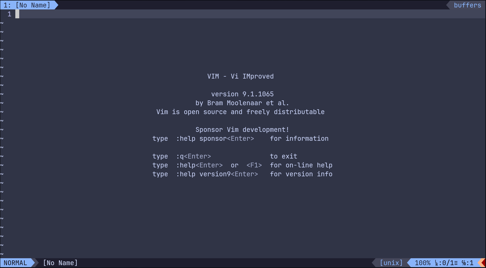
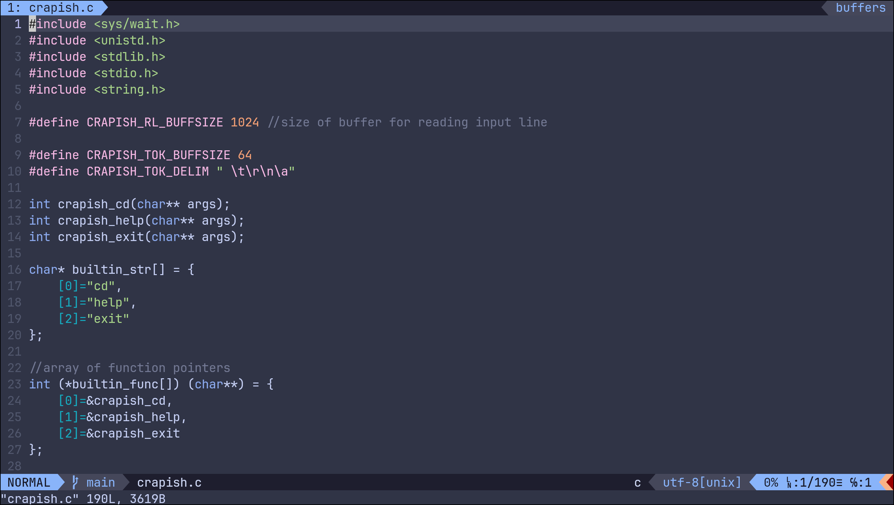
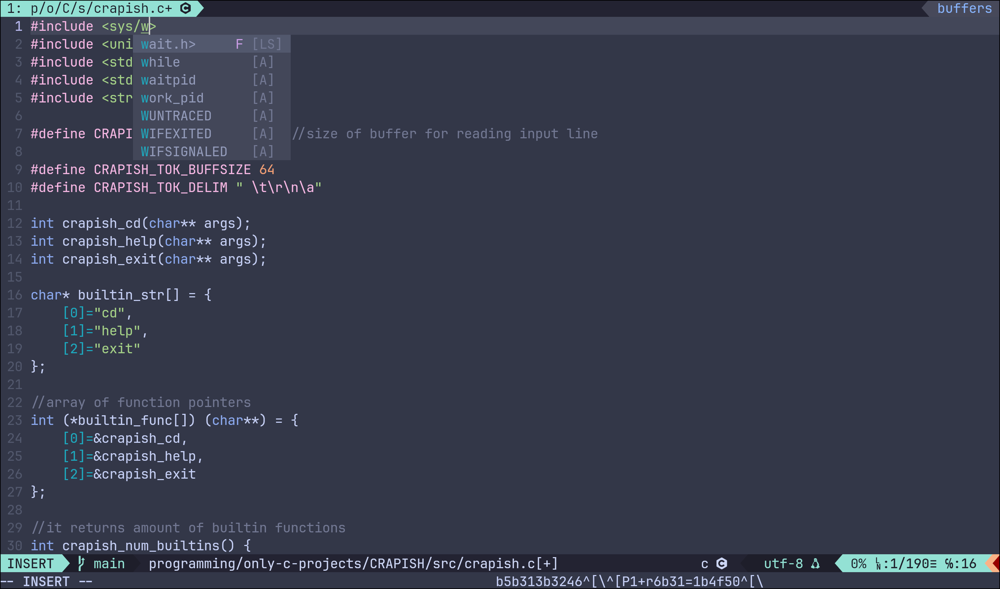

# .vimrc

My simple vim configuration


[](https://github.com/buzzismaloy/Vim-Config/commits/main/)

# Gallery






# Plugins

1. [Vim-Plug](https://github.com/junegunn/vim-plug)
2. [Airline](https://github.com/vim-airline/vim-airline)
3. [NERDTree](https://github.com/preservim/nerdtree)
4. [Catppuccin](https://github.com/catppuccin/vim)
5. [Coc.nvim](https://github.com/neoclide/coc.nvim)
6. [Fugitive.vim](https://github.com/tpope/vim-fugitive)
7. [Vim-Cursorword](https://github.com/itchyny/vim-cursorword)
8. [Vim-go](https://github.com/fatih/vim-go)

# Shortcuts

* **Enable highlighting the max length of line** - `<Leader>cc`
* **Disable highlighting the max length of line** - `<Leader>ncc`
* **tabn, tabp, tabc** - `<Leader> + [tn, tp, tc]`
* **bnext, bprevious, bdelete** - `<Leader> + [bn, bp, bd]`
* **NERDTreeToggle** - `Ctrl + t`
* **NERDTreeFind** - `Ctrl + f`
* **Jump 10 lines up/down** - `Ctrl + k/j`
* **Jump 15 lines right/left** - `Ctrl + l/h`
* **Navigate the completion list** - `Tab/Shift + tab`

# Dependencies

1. You are required `curl` to install `Vim-Plug`, so make sure you have one:
```bash
curl --version
```
2. You are required [Node.js](https://nodejs.org/en/download/package-manager/all) to run `coc.nvim`,
   so make sure you have one:
```bash
node -v
```

3. If you want vim and your system to share the same clipboard you need to install(or build)
   clipboard-enabled vim

Arch

```bash
sudo pacman -S gvim
```

# Installation

1. Clone git repository:
```bash
git clone https://github.com/buzzismaloy/Vim-Config.git
```
2. Go to the Vim-Config and copy the `.vimrc`:
```bash
cd Vim-Config && cp ~/.vimrc
```
3. Open Vim:
```bash
vim
```

# Coc tips

* To open the command list, use the `:CocList commands` command and choose one you need:
```
:CocList commands
```
* To install the extension use the `:CocInstall` command:
```
:CocInstall <the_name_of_extension>
```
* To uninstall the coc extension installed by `:CocInstall` use `:CocUninstall` command:
```
:CocUninstall <the_name_of_extension>
```
* To see the list of installed coc extensions use `CocList` command:
```
:CocList extensions
```

For more information visit the Coc.nvim [wiki page](https://github.com/neoclide/coc.nvim/wiki)

Also, to see the languages supported by coc.nvim, check
this [page](https://github.com/neoclide/coc.nvim/wiki/Language-servers)
